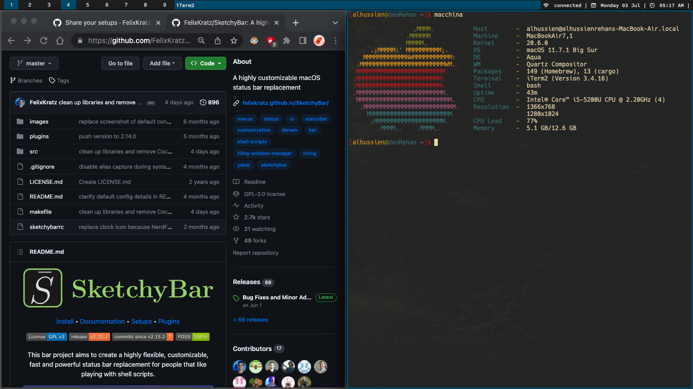

# My yabai and Skhd configuration

## Keyboard shortcuts
For keyboard shortcuts you will find comments explaining them in .skhdrc

## For Icons not showing in sketchybar
NOTE 
If the icons in sketchybar are not showing you need to install mac sf symbols 
you can find it in the link below 

[https://developer.apple.com/sf-symbols/](https://developer.apple.com/sf-symbols/)
